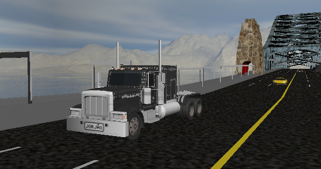
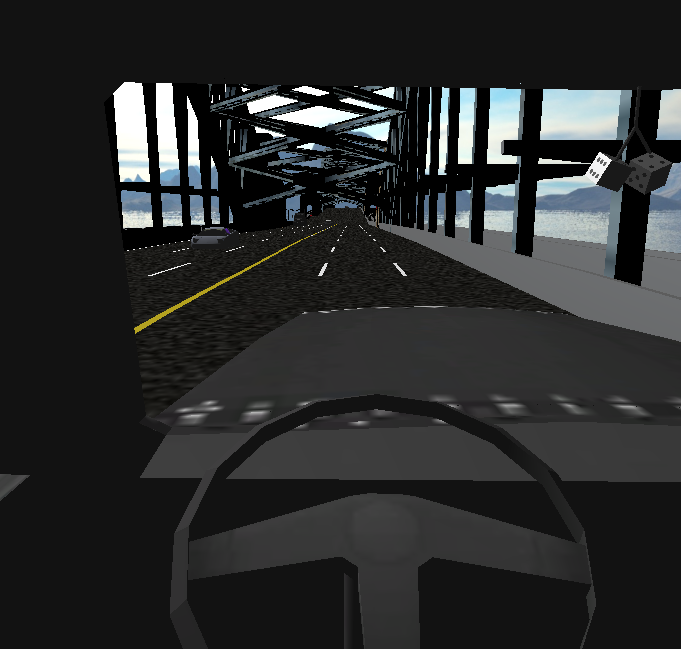

# SIMUL18Trucks

SIMUL18Trucks it's a simple game made with OpenGL to study Computer Graphics.

###  Version

2.0.0

### Features

- Skybox
- Articulation
- Full camera control for 1st and 3rd person
- Smooth movement

### Download

You can download the stable version 2.0.0 in the tab releases. It requires JDK and OpenGL updated to the most recent versions (others versions may be able run it but are not officialy supported).

When opening on a IDE it will need to download dependencies of Maven. Once done, you can compile, run and modify to also be able to study Computer Graphics.

### How to play

- Mouse controls the camera (Q, E, A and D also moves the camera)
- Mouse Wheel zoom in and zoom out while in third person
- W and S move forward and backward
- C changes for first person view (press again to go back for third person view)

### Credits

Started with the [project of Paulovich][credits] 

### License

GPLv3

[credits]: <https://bitbucket.org/fatore/cg-2014.git>